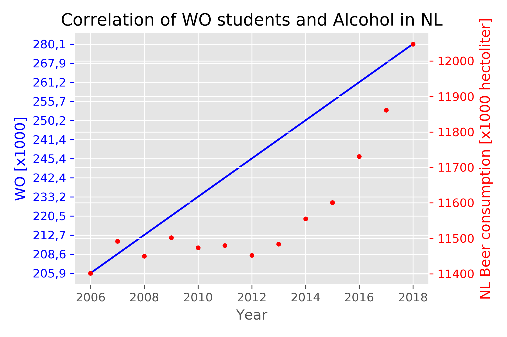

# Papers
- *Fantastic yeasts and where to find them: the hidden diversity of dimorphic fungal pathogens*
- *An analysis of the forces required to drag sheep over various surfaces*
- *The neurocognitive effects of alcohol on adolescents and college students*

# The code

```python

import pandas as pd
import matplotlib.pyplot as plt
import numpy as np
plt.style.use('ggplot')

# Read the file and display it
df = pd.read_csv("istherecorrelation.csv", sep=';')
df.head()

# Choose columns and create figure platform
items = list(df)
fig, ax1 = plt.subplots()

# plot first column
ax1.plot(df[items[0]], df[items[1]], 'b-')

# Give name and color
ax1.set_xlabel(str(items[0]))
ax1.set_ylabel(str(items[1]), color='b')
ax1.tick_params('y', colors='b')

# Join the two
ax2 = ax1.twinx()

# Plot second column
ax2.plot(df[items[0]], df[items[2]], 'r.')

# give name and color
ax2.set_ylabel(str(items[2]), color='r')
ax2.tick_params('y', colors='r')
plt.title("Correlation of WO students and Alcohol in NL")
fig.tight_layout()

# Save the fgure to the right 300 dpi
fig.savefig('thefigure.png', dpi=300)

# Show
plt.show()

```

# The plot


